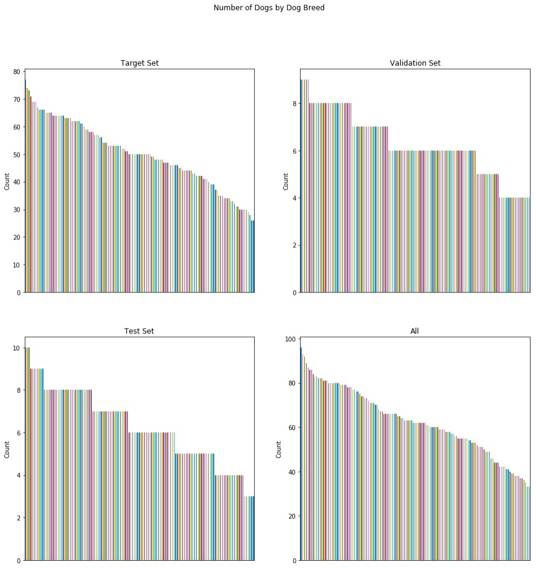
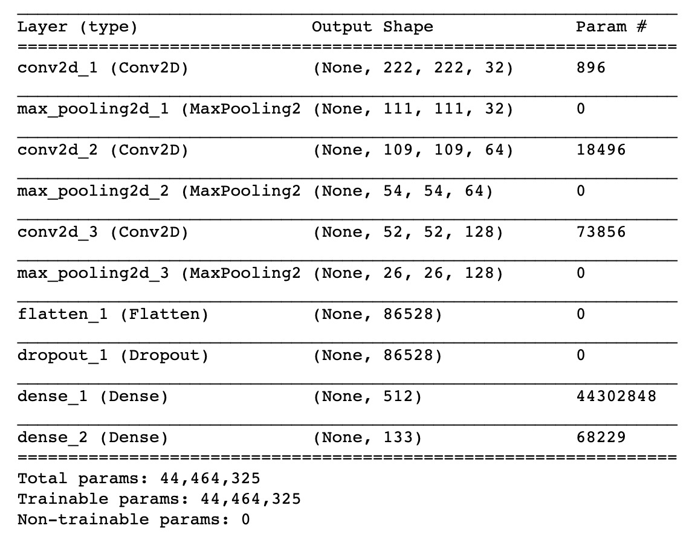
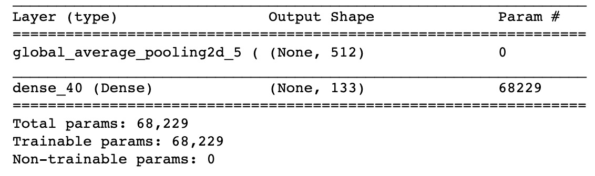
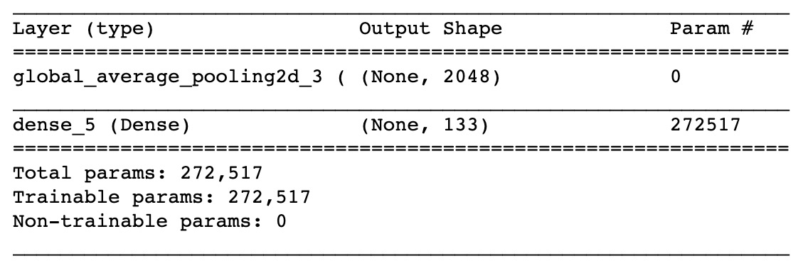
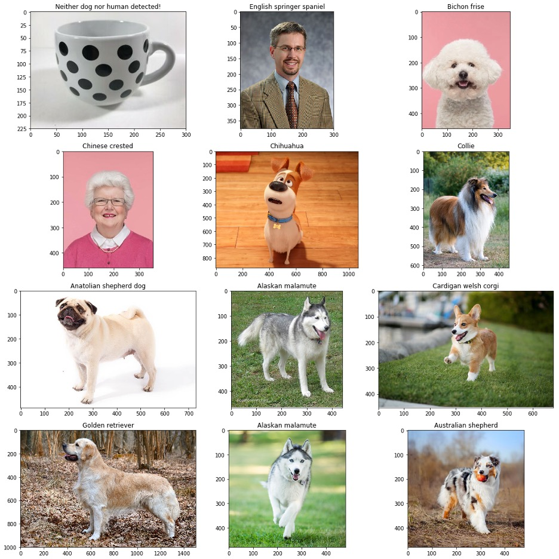

https://medium.com/@preeti.amin/dog-breed-image-classification-aeb6fd273369

## Introduction
An image classification deep learning model was built to classify 133 differnt dog breeds.

## Project Motivation
The project was completed as part of Udacity's Capstone for Data Scientist nanodegree program. The purpose of the project was to gain understanding in Image Classification algortithms using deep learning.

## Libraries
tensorflow, keras, numpy, pandas, matplotlib, scipy, glob, sklearn, cv2

## Files

- dog_app.ipynb: jupyter notebook containing the code

## Data Overview

There are a total of 8351 images in the dogs data set, 6680 were used for training, 835 for validation and 836 for testing. Additionally, 12 more images obtained from the web were tested on the algorithm.

## Methods Used

Keras model from scratch

Keras model utilizing VGG16 as the base

Keras model utilizing Resnet50 as the base

## Results

Accuracy of model from scratch: 12%

Keras model utilizing VGG16 as the base: 41%

Keras model utilizing Resnet50 as the base: 82%

Below are the prediction results for images obtained from the web:

## Conclusion

Overall, it was clear that it was challenging to achieve a high accuracy with a model from scratch. Using a pre-trained model yields much better results in terms of accuracy while reducing the time to train a model significantly.

Further improvements could be made to this model by applying data augmentation, retraining the last top layers of the base model while freezing the remaining layers. Having a larger training data set would also help improve the accuracy of the model.

## Acknowledgements

https://www.udacity.com/
